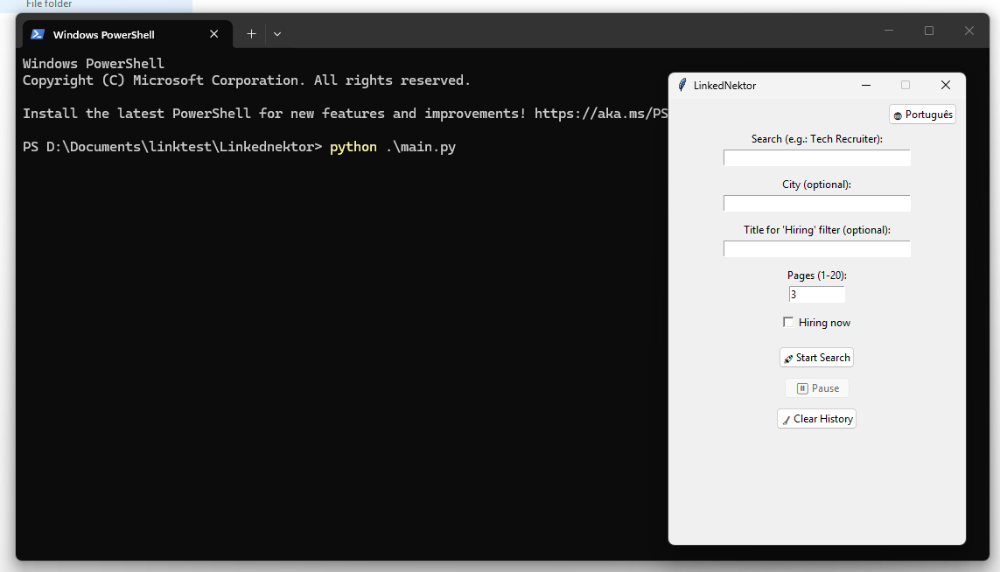

# 🔗 Linkednektor

<div align="center">


**Smart and ultra-resilient automation tool for sending LinkedIn connection invites with simulated human behavior and full control via GUI.**

<br />



<br />

[Features](#-features) •
[Installation](#-installation) •
[How to Use](#-how-to-use) •
[Architecture](#-architecture) •
[Security & Git](#-security--git)

</div>

---

## 📋 About the Project

**Linkednektor** is a desktop automation tool developed in Python for recruitment, marketing, and sales professionals. The program automates the process of searching for people on LinkedIn, applying regional/title filters, and sending connection invites in a highly natural way, simulating real user behavior and logging contacts to prevent duplicate interactions.

---

## ✨ Features

| Feature | Description |
|---|---|
| 🔍 **Keyword Search** | Automatically search by job title, skill, or any keyword on the "People" tab. |
| 📍 **Location Filter** | Applies LinkedIn's native geographical filter for a specific city/region. |
| 🏢 **"Hiring" Filter** | Filters profiles that have active job openings and the "Hiring" banner. |
| 💾 **Persistent Session** | Saves browser cookies and Playwright profile locally so you only need to log in once. |
| 💾 **SQLite3 Database** | Registers processed profiles (`sent` or `already_connected`) in a local database (`linkednektor.db`). The bot automatically skips already approached contacts. |
| ⏸️ **Pause/Resume Controls** | Tkinter GUI buttons for instant, thread-safe pause and resume operations. |
| 📱 **Responsive Layout Support** | Detects elements in both desktop and mobile-responsive layouts of LinkedIn (handling link-based `<a>` buttons and complex `Topcard` wrappers). |
| 🚫 **Mutual Connections Filter** | Ignores mutual connection links listed below search result cards. |
| 📸 **Automatic Debug Dumps** | If an error occurs on a search or profile page, the bot automatically saves a screenshot (`.png`) and the HTML source (`.html`) in the `debug_dumps/` directory, logging clickable links in the console. |
| 🧹 **Clear History** | GUI button to reset the local history database with a confirmation dialog. |

---

## 📦 Installation

### Prerequisites

- Python 3.8 or higher installed.
- Google Chrome installed.
- `pip` package manager installed.

### Step-by-Step

1. **Clone the repository:**
   ```bash
   git clone https://github.com/ianlacerda/Linkednektor.git
   cd Linkednektor
   ```

2. **Create and activate a virtual environment (recommended):**
   ```bash
   python -m venv venv
   # On Windows (PowerShell):
   .\venv\Scripts\Activate.ps1
   # On Linux/Mac:
   source venv/bin/activate
   ```

3. **Install the dependencies:**
   ```bash
   pip install playwright
   ```

4. **Install Playwright browser binaries:**
   ```bash
   playwright install chromium
   ```

5. **Run the program:**
   ```bash
   python main.py
   ```

---

## 🖥️ How to Use

1. Run `python main.py` to open the graphic interface.
2. Enter the search term (e.g., `Design Recruiter`).
3. (Optional) Type the city for regional filtering.
4. Select the number of LinkedIn pages to scan.
5. If desired, check **Hiring now** and enter the hiring job title.
6. Click **🚀 Start Search**.
7. On the first run, the browser will open for you to log in manually. Once logged in, the bot will save your session.
8. To reset tests or clear old contacted records, click **🧹 Clear History** in the GUI.

---

## 🔒 Security & Git

### 1. Protecting Sensitive Data
The project includes a `.gitignore` configured to **never** upload local files containing personal data or active login sessions to GitHub:
* 🔴 `linkednektor.db` (local database history).
* 🔴 `linkednektor_profile/` (Chrome cookies and active LinkedIn credentials).
* 🔴 `debug_dumps/` (auditing screenshots and HTML dumps).

> [!WARNING]
> Never delete or modify the `linkednektor_profile/` entry in `.gitignore`. It contains your live LinkedIn credentials.

---

## 📄 License

This project is licensed under the MIT License. See the LICENSE file for details.
